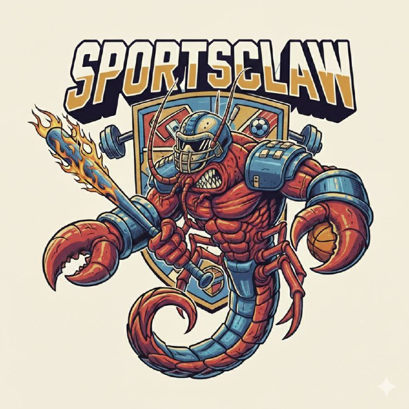

<p align="center">
  
</p>

# sportsclaw 🦞

A CLI and bot scaffold that connects any LLM to live sports data via [sports-skills](https://sports-skills.sh).

---

### What is sportsclaw?

sportsclaw is a TypeScript CLI and bot scaffold that connects any LLM to deterministic Python sports data — scores, odds, standings, play-by-play, player stats — through the [`sports-skills`](https://sports-skills.sh) package. It works with Anthropic, Google (Gemini), and OpenAI models via the [Vercel AI SDK](https://sdk.vercel.ai). ~2,300 lines of TypeScript total, with the core agent loop at ~80 lines.

### What can you build with it?

sportsclaw gives you a working sports AI agent in minutes. Here's what people build:

- **Discord/Telegram bots** — Deploy a sports bot to your server that answers questions like "What are today's NBA scores?" or "Show me the Premier League table" with real data, not hallucinated guesses. Built-in listeners for both platforms.
- **Fantasy football assistants** — Build a personal agent that pulls player stats, injury reports, matchup data, and news across NFL, NBA, MLB, NHL, and more to help you make lineup decisions.
- **Real-time F1 alerts** — Use the `fastf1` skill to pull qualifying results, lap times, and race data. Pipe it into Telegram or Discord for your group chat.
- **Sports betting dashboards** — Combine live odds from `kalshi` and `polymarket` with real game data from `nfl-data` or `football-data` to spot value. The agent pulls both sides — actual stats and market prices — in one query.
- **Multi-sport news digests** — The `sports-news` skill aggregates headlines across leagues. Build a morning briefing bot that summarizes what happened overnight across the sports you care about.
- **Custom CLI tools** — Run one-shot queries from your terminal: `sportsclaw "Who leads the Premier League in goals?"` and get a sourced answer in seconds.

### Why sportsclaw?

**Readable codebase.** ~2,300 lines of TypeScript built on the Vercel AI SDK. The core agent loop is ~80 lines. Easy to fork, extend, or learn from.

**Data comes from Python, not the LLM.** sportsclaw calls deterministic Python functions ([`sports-skills`](https://sports-skills.sh)) to fetch scores, standings, and stats. The LLM decides *what* to look up, but the data itself comes from ESPN, FastF1, Kalshi, and other real sources — not from the model's training data. This eliminates hallucinated scores and stats.

**Zero API keys for the data layer.** You need an `ANTHROPIC_API_KEY` (or `OPENAI_API_KEY` / `GEMINI_API_KEY`) for the reasoning model, but every sports data skill works completely out of the box with zero API keys required for the data layer — no ESPN API key, no paid data subscriptions, no OAuth setup. Install `sports-skills` via pip and you're done.

**Working agent in 5 minutes.** Install, set one env var, run a query:

```bash
npm install sportsclaw-engine-core
pip install sports-skills
export ANTHROPIC_API_KEY=sk-...   # or OPENAI_API_KEY / GEMINI_API_KEY

sportsclaw "What are today's NFL scores?"
```

Or use it as a library:

```typescript
import { sportsclawEngine } from "sportsclaw-engine-core";

const engine = new sportsclawEngine();
const answer = await engine.run("Who leads the Premier League?");
```

**Docker in one command.** Ship the whole thing — Node.js engine + Python data layer — as a single container:

```bash
docker build -t sportsclaw .
docker run --rm -e ANTHROPIC_API_KEY=sk-... sportsclaw "Who won the Super Bowl?"  # or pass OPENAI_API_KEY / GEMINI_API_KEY
```

### When should you use it?

sportsclaw is built for:

- **Personal hacking** — You want a sports agent that actually works, not a research project. Get answers from real data in your terminal or a script.
- **Discord and Telegram communities** — Deploy a bot that your group can ask sports questions. Built-in listeners handle the wiring; you just add your bot token.
- **Prototyping sports AI products** — Test whether an AI sports feature is viable before building infrastructure. sportsclaw gives you the agent loop and data access so you can focus on the product idea.
- **Learning how agents work** — The core loop is ~80 lines on the Vercel AI SDK. Read it, modify it, extend it.

### Built-in Sports Data Skills

sportsclaw ships with **14 sports data skills** out of the box, powered by [`sports-skills`](https://sports-skills.sh):

`football-data` `nfl-data` `nba-data` `nhl-data` `mlb-data` `wnba-data` `tennis-data` `cfb-data` `cbb-data` `golf-data` `fastf1` `kalshi` `polymarket` `sports-news`

> **[sports-skills.sh](https://sports-skills.sh)** — Full documentation for all built-in skills.

### Inspiration & Acknowledgements

sportsclaw's execution engine draws direct inspiration from [NanoClaw](https://github.com/qwibitai/nanoclaw/), [pi.dev](https://pi.dev), and [OpenClaw](https://github.com/anthropics/openclaw). Built on the [Vercel AI SDK](https://sdk.vercel.ai) for multi-provider LLM support. The interactive CLI setup and reasoning spinner are powered by [@clack/prompts](https://github.com/natemoo-re/clack).

### Questions?

Join the community on Discord to discuss sportsclaw, sports-skills, and building AI agents for sports: [Join the Machina Sports Discord](https://discord.gg/CU5KmQWHD9)

---
*Built by the [Machina Sports](https://machina.gg) team.*
